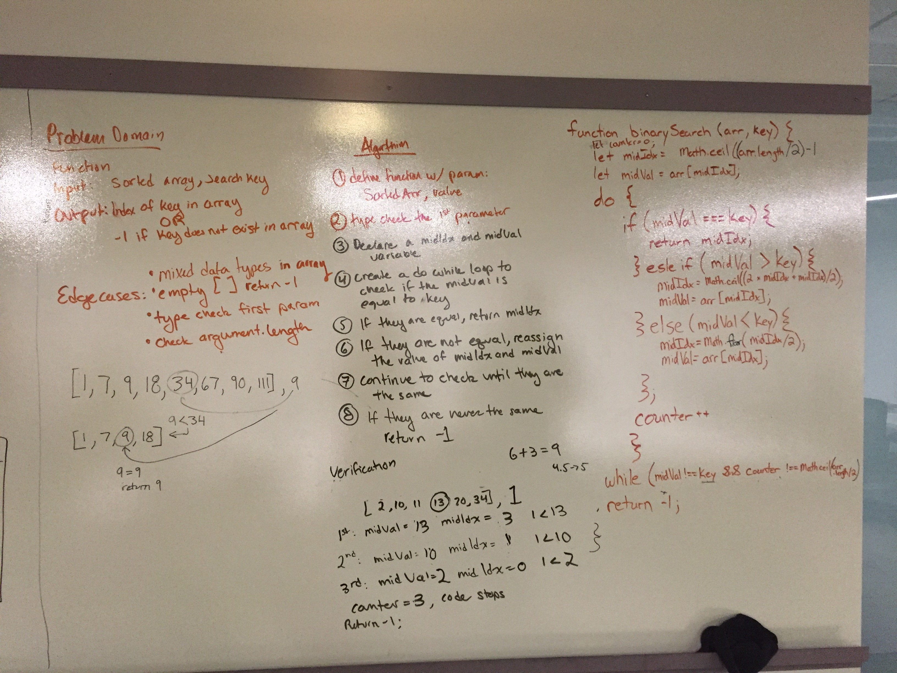

# Binary Search
##Work with a partner to whiteboard, code and test a task: take a sorted array and an key value. Find the index of where the key value is in the array. 

#Challenge:
##Take a sorted array and an key item. Find the idx where the key value is located. Return that key index if it is found. If it is not found, return -1.

#Approach & Efficiency
## Declare variables midVal and midIdx to keep track of where you are in your array. Run a for loop for the array. Inside, check three if statements: if val and key are equal, return the idx. If the key is less than the midVal, redeclare the midVal and midIdx to the the value between the start and the former midValue. If the midVal is greater than the key, redefine the midVal and the midIdx to the be at the place between the former midvalue and the end of the array. Repeat this process. If the for loop ends the you still haven't foudn the key in the array, return -1. 

# Solution: 

