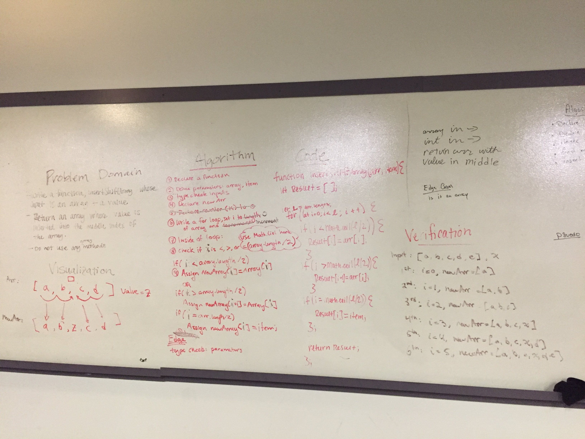

# Insert and shift middle index of array
##Work with a partner to whiteboard, code and test a task: take an array and an item, insert the item into the middle of the array without using JavaScript methods

#Challenge:
##Take an array and an item, insert the item into the middle of the array without using JavaScript methods. 

#Approach & Efficiency
## Craete a new array, loop through the array, and assign values to the new array. For each loop, check if i is less than, equal to, or greater than the length of the array divided by 2. Assing a new value to your new array, and then return that new array.

# Solution: 

