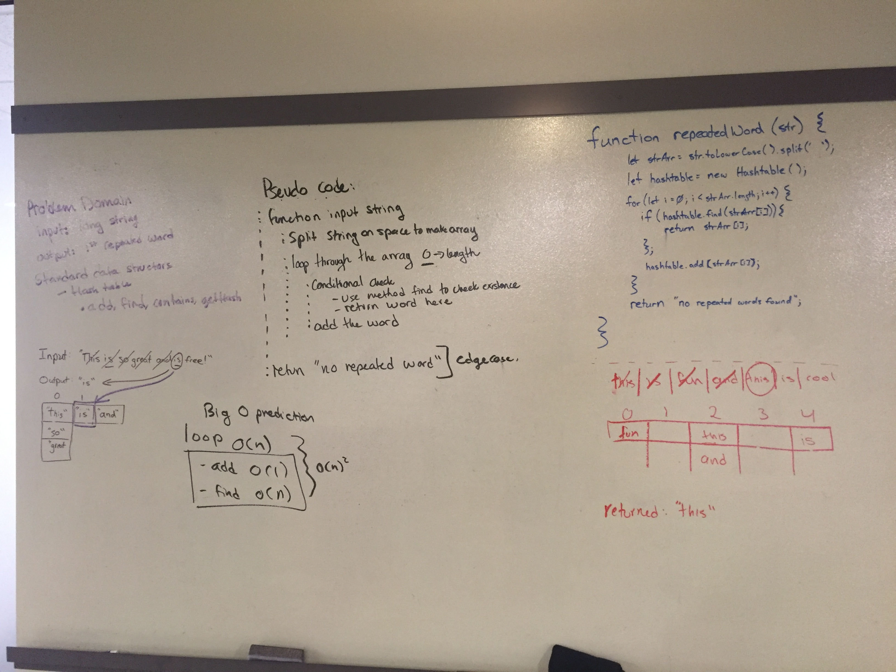

#Linked Lists
#### Description: Create a hashtable class. Within the class,creat the following methods:
* A method hash that hashing the key to a value between 0 and the size of the array
* A method add that takes in both the key and value. This method should hash the key and add the key and value pair to the table.
* A method/function named Find that takes in the key and returns the value from key/value pair.
* A method/function named contains that takes in the key and returns if the key exists in the table already.
* A method/function named GetHash that takes in a key and returns the index in the array the key is stored.

#### Approach & Efficiency
* hash O(1): To hash, I used the approach of dividing by a prime number, 19, the divided the remainder by 19 to get a number between 0 and 1. You can then multiply the number by the size of the array and round down to find the index of where the value should go. 
* Add O(1) 
* Find O(n)
* Contains O(n)
* getHash O(1)

#### Tests:
Run test: `npm run test-watch`
Assertions: 3 test assertions for each method to check that it returns the correct value

### Day Two: Repeated Words 

Run test: `npm run test-watch`
Assertions: 3 test assertions for each method to check that it returns the correct value

#### Description: 
* Write a function that accepts a lengthy string parameter.
* Without utilizing any of the built-in library methods available to your language, return the first word to occur more than once in that provided string.

#### Approach: 
* Use the find method to check if something is already in the table
* if it is in the table, return the word itself
* Use the add method to add the value to the table

#### Big O
* With a poor hash function and a small table, this would be O(N^2)
* * The worst case scenario is looping through the entire array, and looping through a bucket containing all the values
* With a strong hash function, this would be O(N)
* * looping through the array is O(N), and the loop up and add would be O(1)

