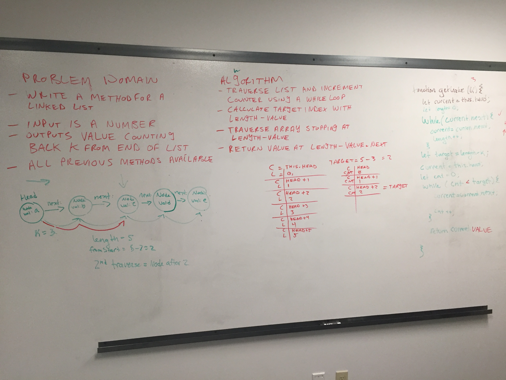
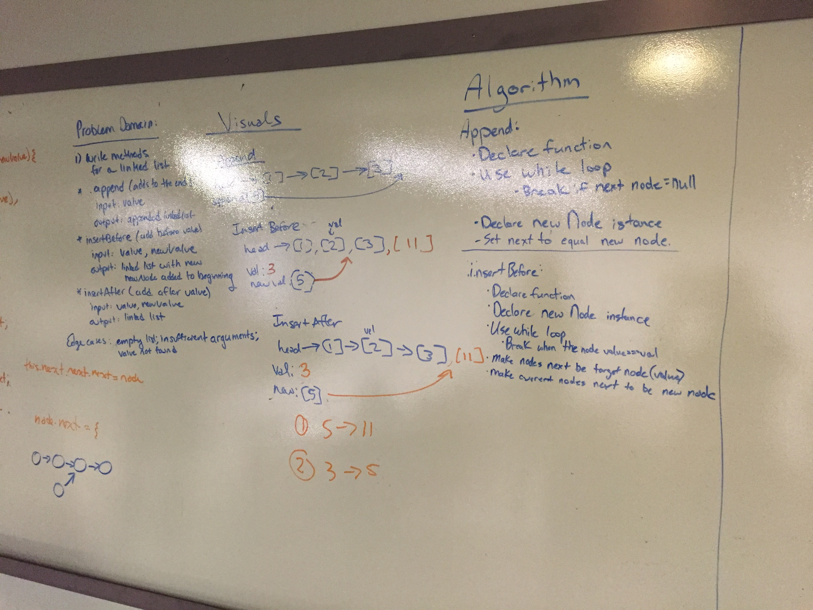
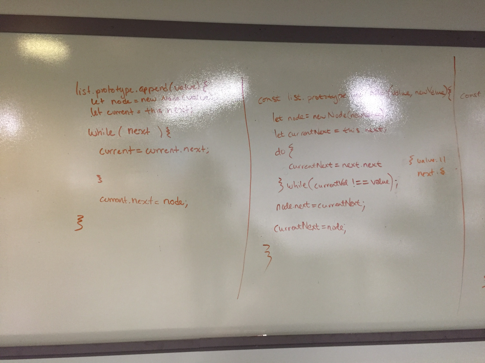
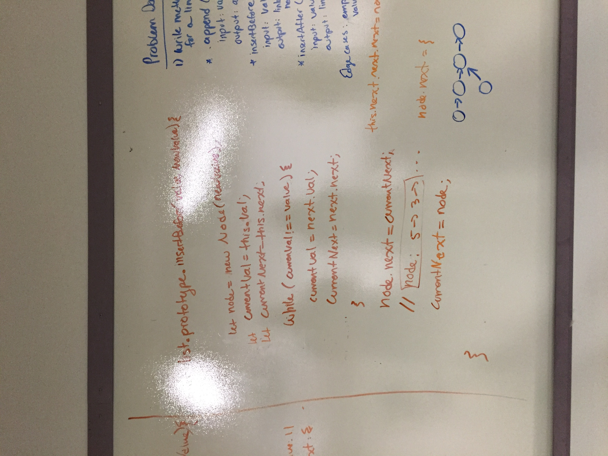
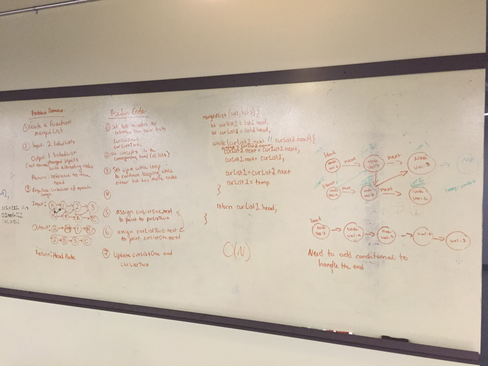

## Linked Lists
#### Description: Create a class that creates a linked list. Create methods so that one can insert new nodes, print the current list, and determine if a value is included in the linked list.

## Challenge:
#### Create linked lists class. Add methods that determines if a value is included, prints all the values, and inserts new nodes to the end of the linked list.

## Approach & Efficiency
#### Create a class for a new node that includes a constructor. Write this constructor to take a value and give it two properties, a value and a next. Create a nother class classed Linkedlist. Create a constructor that takes no values and assign it a property of head, set equal to null. 

## Methods: 
#### Insert: Defined a method insert that takes a value and instantiates a new node. If a value is provided, and a head has not been created, assign the value to the head. Then, let the current thing be equal to the current node. While the property has a next value that is not null, keeping looking through the list. When the next is equal to null, assign a new node here.

#### Includes: Define a methods that takes a value. Set the value to false. Start with checking the head property. Use a while loop to check every value at every node in this list. If the value equals the node at any point, return true. Else, at the end of the while loop, return false.

#### Print: Defind a method print that takes no arguments. Use a while loop to go through each node while the node has a value property. Push every value into an array. Then return the final array. 

### Tests:
Assertions: 
Inserts new node that has a vale and a next property. New nodes will be inserted at the end with a next property equal to null.
Search through all values when includes propety is called to determine if there is a value included in the node list and returns the correct boolean value.
Correcly prints out all the values of the linked list as an array. 

## Day 2: 

#### Challenge: Write a method for the Linked List class which takes a number, k, as a parameter. Return the node’s value that is k from the end of the linked list. You have access to the Node class and all the properties on the Linked List class as well as the methods created in previous challenges.

#### Description: Write the method described above on a linked list. Include tests for your new method.

## Day 3: 

### Challenge: Write the following methods for the Linked List class: Append(value) which adds a new node with the given value to the end of the list. Write a function insertBefore(value, newVal) which add a new node with the given newValue immediately before the first value node. Write a function insertAfter(value, newVal) which add a new node with the given newValue immediately after the first value node.

### Description: Write three new methods to complete the challenge specified above.

## Day 4:

#### Challenge: Write a function called mergeLists which takes two linked lists as arguments. Zip the two linked lists together into one so that the nodes alternate between the two lists and return a reference to the head of the zipped list. Try and keep additional space down to O(1). You have access to the Node class and all the properties on the Linked List class as well as the methods created in previous challenges.

#### Description: Write the funciton in a new file. Write three tests that check the function. Before you type up the function, write your solution on a whiteboard. You may use methods from the class that you have written.

