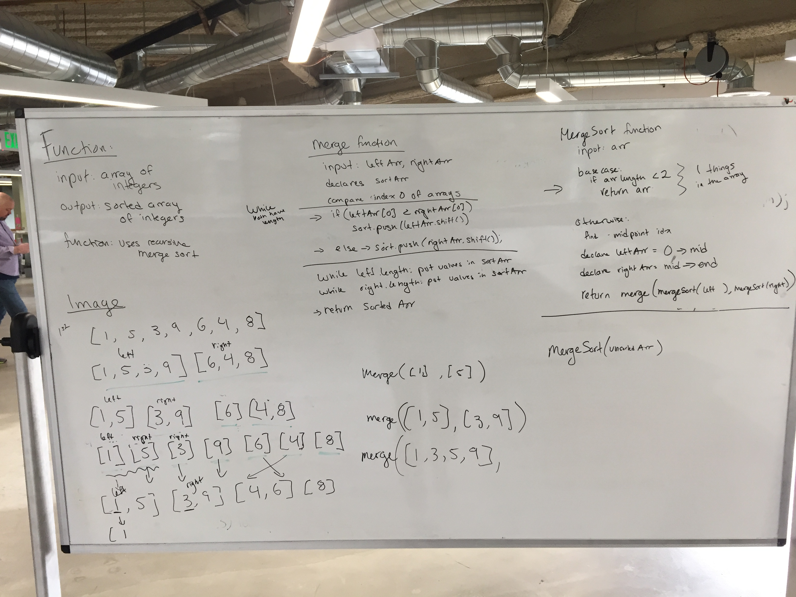

# Sorts
Sorting algorithms sort a collection of items into an ordered collection. 

## Challenge: Merge Sort
Write a function that accepts an array of unsorted integers, and returns a sorted array by a recursive mergesort algorithm.
* Merge: Merges two input arrays given two sub arrays that are ordered
* MergeSort: calls merge and gives it two arguments that call mergesort recursively

### Description: 
* Mergesort takes the unsorted array
  * Mergesort splits the array in two
  * Mergesort calls merge with two arguments that call mergesort on left and right array
  * base case for mergesort is that the array has a length of 1, so mergesort recurses until it has two array's of 1
  * merge orders the two arrays of 1, then the two ordered arrays of 2, then the 2 ordered arrays of 4 ect.
  * The last merge will be done with two orderd arrays that represented the first half and the second half of the original array

### Tests:
* npm run tests-watch 
* assersions: orders the array
* does not mutate the original array
* retains all numbers, included repeated values

#### Whiteboard:

## QuickSort
### Description: Write a function that accepts an array of integers, and returns an array sorted by a recursive quicksort algorithm.

### Quick-Sort-Inplace
#### Description: 
* write a function pivot 
  * input: arr, start, end
  * set the pivot value at start
  * loop through values start -> end and put them in a left and right stack according to how values compare to pivot
  * replace values in the original array with values from the left stack and right stack so that they are arranged to the left and right of the pivot appropriately
  * place the pivot in it's correct place in the array
  * return the value of the pivot

* write a function quickSort
  * input: arr
  * call pivot to find the idx of the pivot
  * call a helper function on everything before the pivot
  * call helper on everything after the pivot

* write a recursive helper function
  * input: arr, start, end
  * basecase: if the start value is greater than or equal to the end, return null
  * find the pivot idx given the subsection of the array defined by start and end indicies
  * call helper recursivesly on the subarray left of the pivot
  * call helper recursively on the subarry right of the pivot

### Quick-Sort (not in place) 
#### Whiteboard:
[image](./assets/quick-sort.JPG)

## Radix Sort
### Description: Write a function that accepts an array of positive integers, and returns an array sorted by a radix sort algorithm.

### Description: Sort an array using radix sort. Sort the array digit by digit. Start with the least significant digit. Create a buckets array that stores 10 empty buckets. Sort the items in the array digit by digit. 

## Big O
b is the base system of the numbers
d is the maximum number of digits of the number collection
Space: O(n+b)
Time: O(d(n+b))

### Whiteboard:
[image](./assets/radix-sort.JPG)

