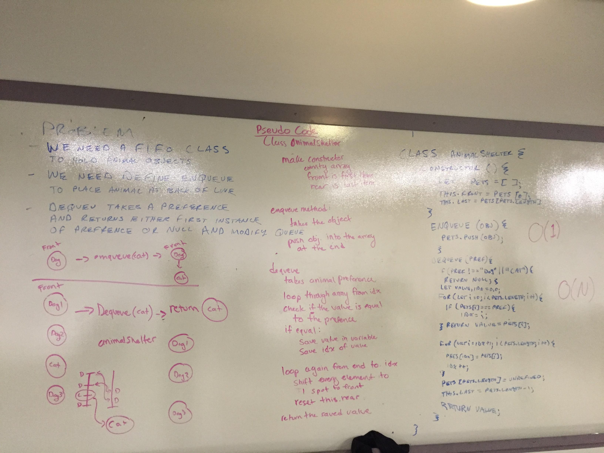

#Stacks and Queues:
### Create two classes for stacks and queues. For each class, write methods to add, remove, and return the nodes added to the class. For each class, use the node constructor as specificied: 
* Create a Node class that has properties for the value stored in the Node, and a pointer to the next node.

##Stack Class & Methods
* Create a Stack class that has a top property. It creates an empty Stack when instantiated.
* This object should be aware of a default empty value assigned to top when the stack is created.
* Define a method called push which takes any value as an argument and adds a new node with that value to the top of the stack with an O(1) Time performance.
* Define a method called pop that does not take any argument, removes the node from the top of the stack, and returns the node.
* Define a method called peek that does not take an argument and returns the node located on the top of the stack.

##Queue Class & Methods
* Create a Queue class that has a top property. It creates an empty queue when instantiated.
* This object should be aware of a default empty value assigned to front when the queue is created.
* Define a method called enqueue which takes any value as an argument and adds a new node with that value to the back of the queue with an O(1) Time performance.
* Define a method called dequeue that does not take any argument, removes the node from the front of the queue, and returns the node.
* Define a method called peek that does not take an argument and returns the node located in the front of the stack.

# Tests:
Assertions: 
* push: push a node to the top; set the next value of the new node to be the previous top; will return the original stack if no value is provided

* pop: removes the top node from the stack; return s the top node from the stack; sets the next node to be the new top
* peek: returns the top node from the stack; does not mutate the stack; sets the next value of the return node to null

* enqueue: adds something to the rear of the queue; does not change the front value of the queue; has a next value of null

* dequeue: returns the first node; resets the first node to be the next in line; returns the first node with the next property set to null

* peek: returns the first value; returns the first value with next set to null; does not mutate the stack

##Day 2: Stacks With Queues:

### Description: Create a brand new PseudoQueue class. Do not use an existing Queue. Instead, this PseudoQueue class will implement the standard queue interface, but will internally only utilize 2 Stack objects. Ensure that you create your class with the following methods: enqueue(value) which inserts value into the PseudoQueue, using a first-in, first-out approach. dequeue() which extracts a value from the PseudoQueue, using a first-in, first-out approach. The Stack instances have only push, pop, and peek methods. You should use your own Stack implementation. Instantiate these Stack objects in your PseudoQueue constructor.

### Challenge: Write the enqueue and dequeue methods using the two pop and push method with stacks. Instantiate two stacks in you methods to help you write this code. 

##Day 3: Fifo Animals Shelfter with FIFO:

### Description: Create a class called AnimalShelter which holds only dogs and cats. The shelter operates using a first-in, first-out approach.Implement the following methods: enqueue(animal): adds animal to the shelter. animal can be either a dog or a cat object. dequeue(pref): returns either a dog or a cat. If pref is not "dog" or "cat" then return null.

### Challenge: Write the class. Use the first in first out principal to take the elements out of the class. When you dequeue, dequeue the first of the animals requested and remove the animal from the list. 

;

