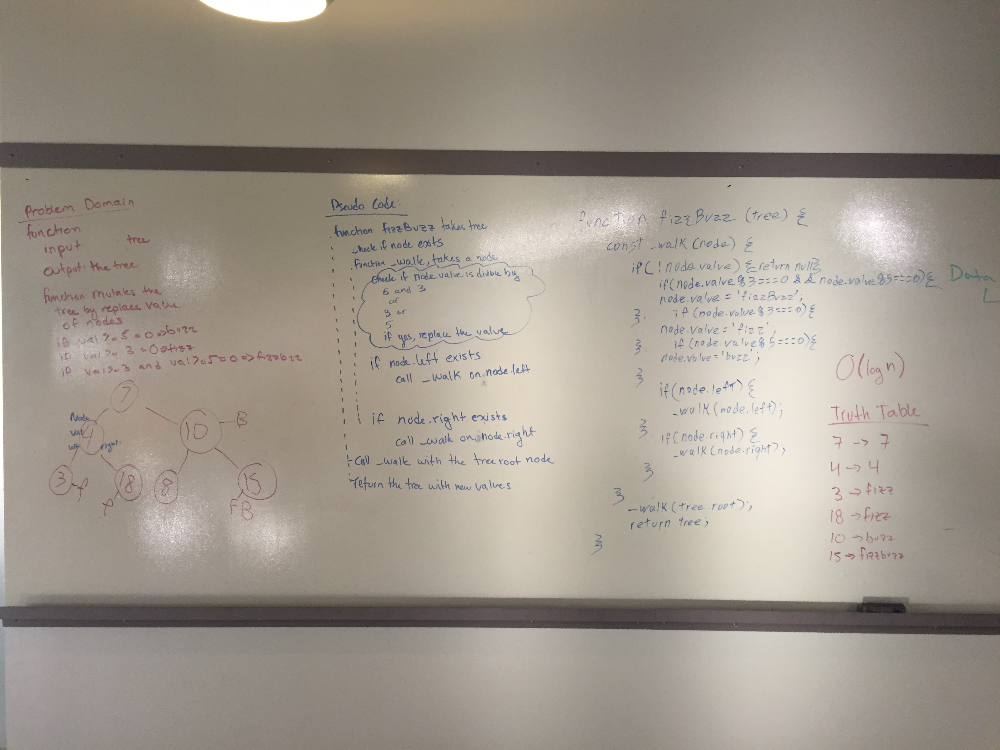
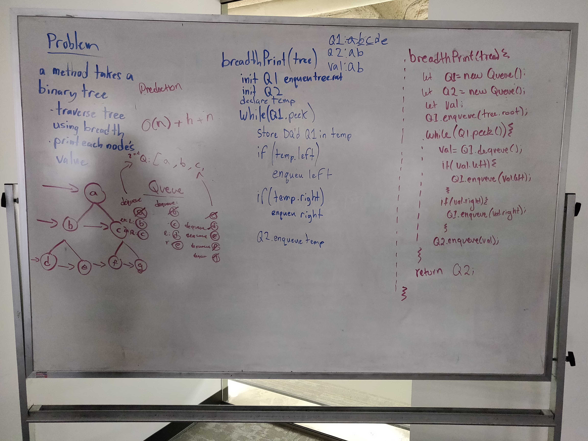

#Trees & Binary Search Trees

##Description: Create a Node class that has properties for the value stored in the node, the left child node, and the right child node.
Create a BinaryTree class
Define a method for each of the depth first traversals called preOrder, inOrder, and postOrder which returns an array of the values, ordered appropriately.
At no time should an exception or stack trace be shown to the end user. Catch and handle any such exceptions and return a printed value or operation which cleanly represents the state and either stops execution cleanly, or provides the user with clear direction and output.

Create a BinarySearchTree class
Define a method named add that accepts a value, and adds a new node with that value in the correct location in the binary search tree.
Define a method named contains that accepts a value, and returns a boolean indicating whether or not the value is in the tree at least once.

#Challenge:
##For each class, create the specified methods above. Write three tests for each class method defined. Use recursion to traverse the trees. 

#Approach & Efficiency
#Create a class for a new node that includes a constructor. Create a class BinaryTree, and a class BinarySearchTree that extends BinaryTree. Use recursive methods to write all functions to print preOrder, inOrder, and postOrder. Use recursion to insert values, and check if a value is contained. 

Trav

# Tests:
Assertions: 
Inserts new node that has a vale and a next property. New nodes will be inserted at the end with a next property equal to null.
Search through all values when includes propety is called to determine if there is a value included in the node list and returns the correct boolean value.
Correcly prints out all the values of the linked list as an array. 

Travis Link: https://www.travis-ci.com/hingham/data-structures-and-algorithms

##Day 2: 

## Challenge:Write a function called FizzBuzzTree which takes a tree as an argument.
Without utilizing any of the built-in methods available to your language, determine weather or not the value of each node is divisible by 3, 5 or both, and change the value of each of the nodes:
If the value is divisible by 3, replace the value with “Fizz”
If the value is divisible by 5, replace the value with “Buzz”
If the value is divisible by 3 and 5, replace the value with “FizzBuzz”
Return the tree with its new values.

For explicitly-typed languages: Ensure your node values are of type Object, to hold either strings or integers.

#Description: Traverse the linked list. Check at each node if it is divisible by 3, 5, or both. If it is, change the value of the node before moving to the next node. 

[]

(https://www.travis-ci.com/hingham/data-structures-and-algorithms)
https://www.travis-ci.com/hingham/data-structures-and-algorithms

##Day 3: Write a breadth first traversal method which takes a Binary Tree as its unique input. Without utilizing any of the built-in methods available to your language, traverse the input tree using a Breadth-first approach; print every visited node’s value.

#Description: Traverse the binary tree, moving across each level of the nodes. Use a queue to move through all the nodes. Print the nodes in the order that they were visited as an array. 

##Day 4:Write a function called find-maximum-value which takes binary tree as its only input. Without utilizing any of the built-in methods available to your language, return the maximum value stored in the tree. You can assume that the values stored in the Binary Tree will be numeric.

